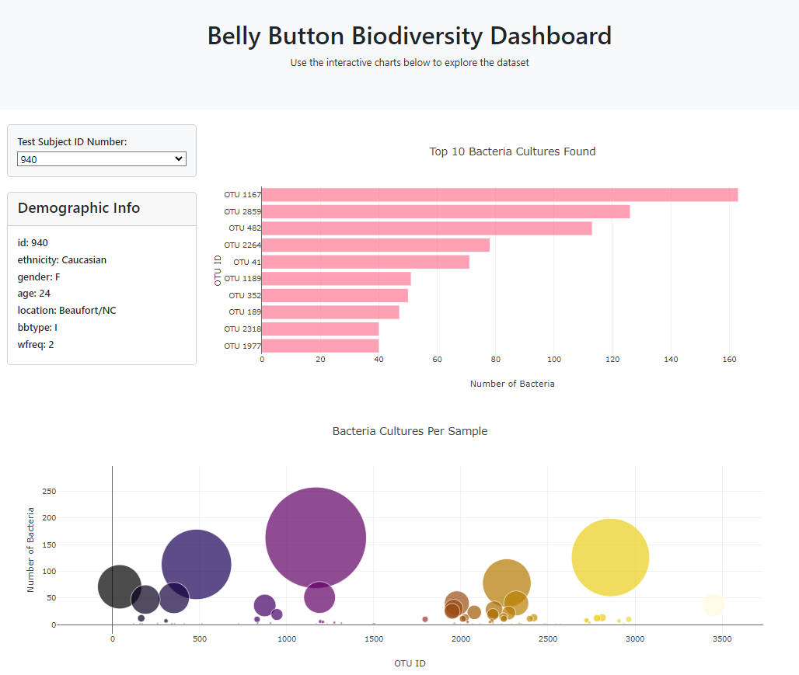

# Exploring the Microbial Diversity of Our Belly Buttons

Melissa Morales

# Reference Dataset
https://robdunnlab.com/projects/belly-button-biodiversity/

# Overview

The assignment involves creating an interactive dashboard to analyze the "Belly Button Biodiversity dataset" using Plotly, a JavaScript data visualization library. JavaScript will be utilized to enhance the interactivity and appeal of the visualizations.

